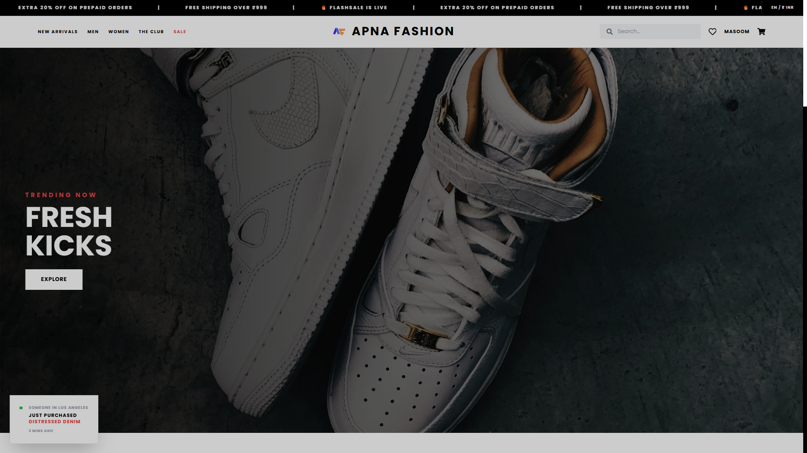

# APNA FASHION ⚡️
**Premium E-Commerce Streetwear Platform**



A high-performance, full-stack React frontend built for an ultra-premium streetwear brand. Features brutalist typography, pure black-and-white minimalist layouts, and buttery-smooth native-app transitions.

## Features
- **Framer Motion Animations:** Zero-jitter page cross-fades and a physics-based spring-animated sliding Cart Drawer.
- **Context API Backend:** Robust `localStorage` caching for the Cart, Wishlist, Authenticated User State, and Order History.
- **Premium UI/UX:** Underline-only forms, glassmorphism login cards, sticky marquee banners, and auto-complete search.
- **Admin Dashboard:** A highly editorial, split-pane dashboard to track revenue, inventory, and recent orders.
- **Social Proof Engine:** A custom, randomized "Live Sales" notification pop-up component.
- **Fully Responsive:** Flawless mobile-first design leveraging Tailwind CSS.

## Tech Stack
- **Framework:** React.js (React Router v6)
- **Styling:** Tailwind CSS
- **Animations:** Framer Motion
- **Icons:** React Icons
- **State Management:** React Context API

## Installation
```bash
# Clone the repository
git clone https://github.com/your-username/apnafashion.git

# Install dependencies
npm install

# Start the development server
npm start
```

## Credits
Designed and developed as a luxury web template.
